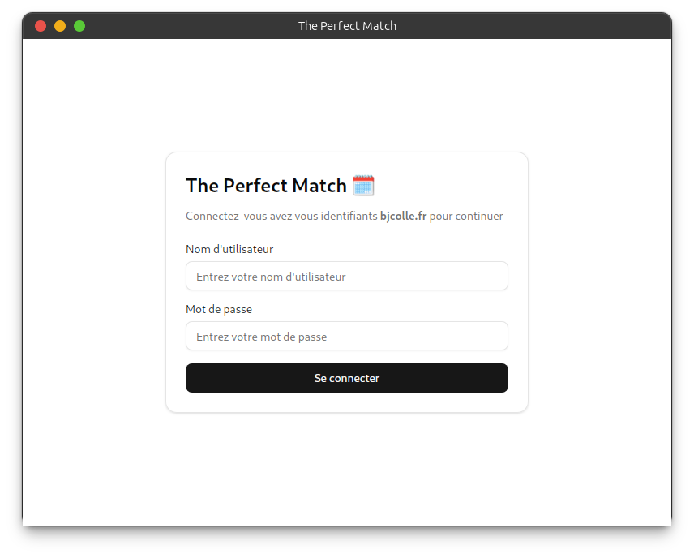
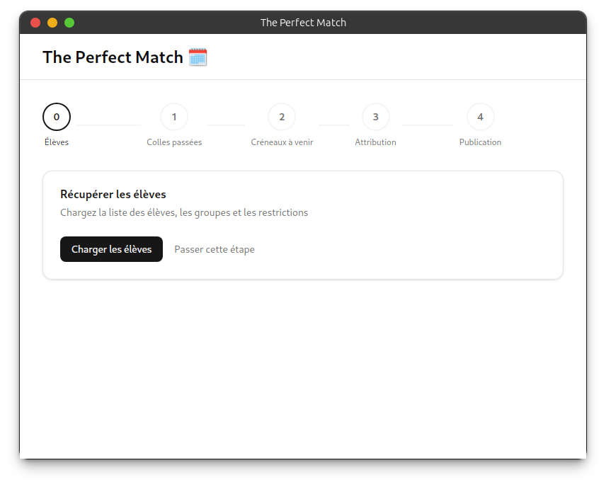
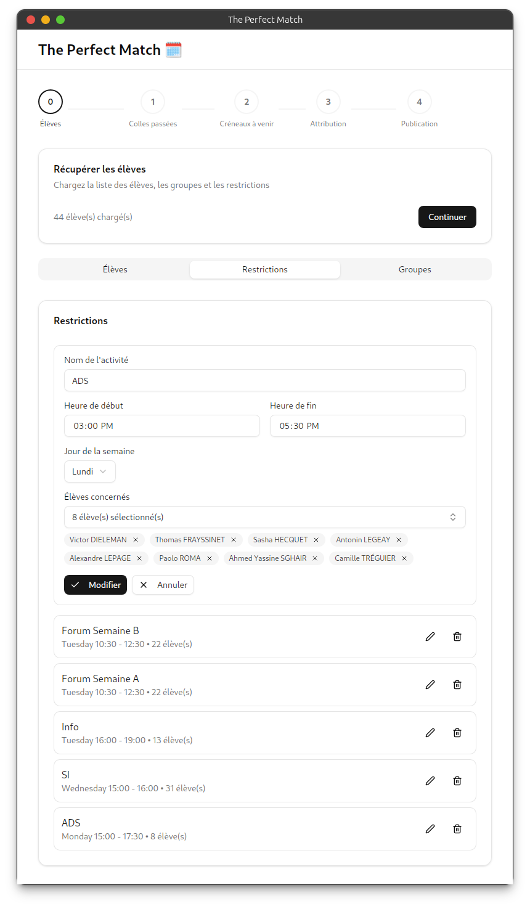
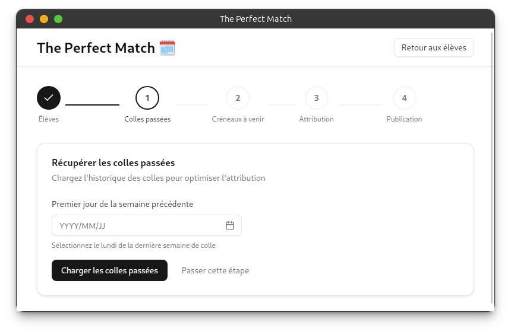
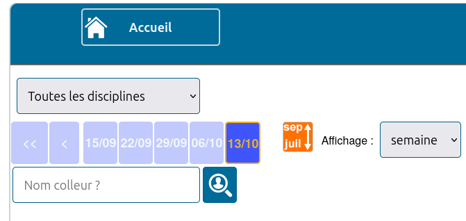
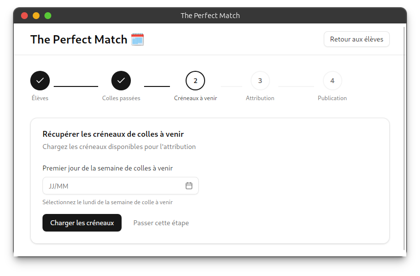
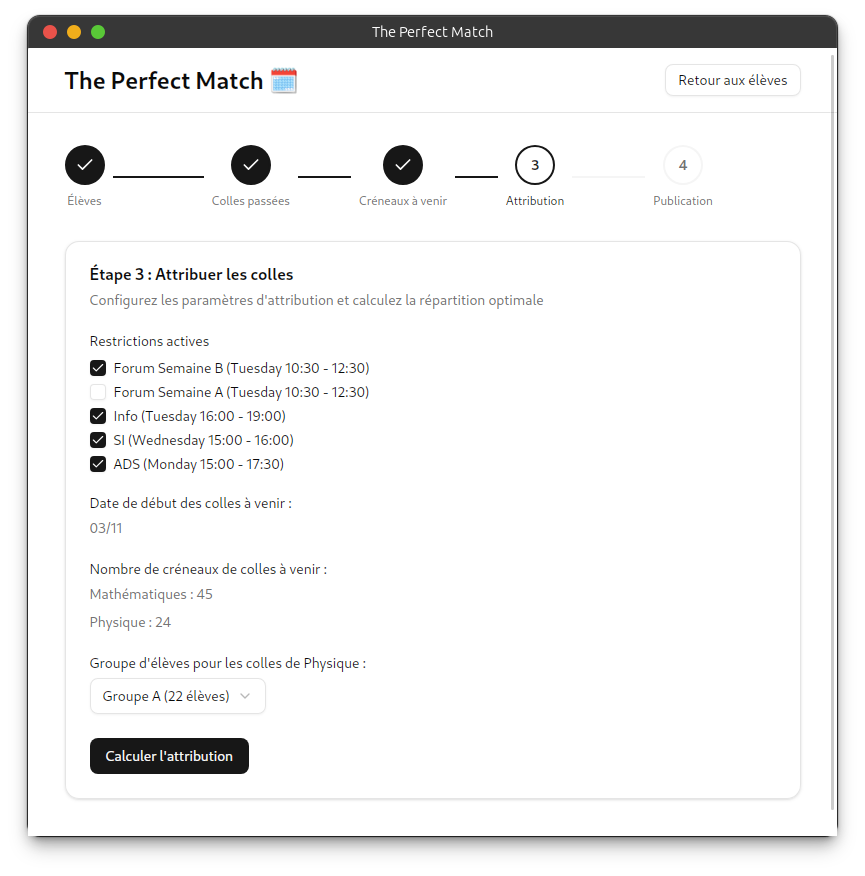
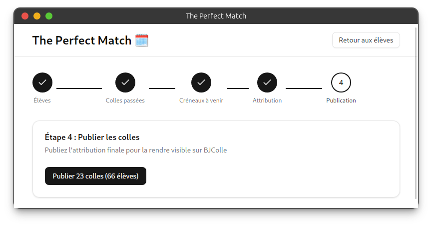

# 🧩 The Perfect Match

**Application d’aide à l’affectation automatique des colles pour les CDT**

---

## 🚀 Objectif

**The Perfect Match** a pour but de faciliter le travail des chargés de travail (CDT) en automatisant l’affectation des colles, tout en respectant les contraintes des élèves et des colleurs.

---

## 📥 Téléchargement de l’application

Rendez-vous sur la page des [releases](https://github.com/nathan-lamy/the-perfect-match/releases) et téléchargez la dernière version adaptée à votre système d’exploitation (Windows, macOS ou Linux).

L'application n'est pas signée, vous devrez peut-être autoriser son exécution dans les paramètres de sécurité de votre système. Votre antivirus peut également émettre des alertes lors du premier lancement.

Le code source est disponible sur ce dépôt GitHub. Les releases sont compilées automatiquement par GitHub Actions.

## 🧭 Fonctionnement général

### 🏁 Première utilisation

1. Connectez-vous avec vos identifiants **bjcolle**

2. Chargez la **liste des élèves**

3. Créez les **groupes d’élèves**

4. Définissez les **restrictions générales** (disponibilités, incompatibilités, etc.)

---

### 📅 Chaque semaine

1. Ajoutez les **restrictions spécifiques** de la semaine en cours (les ADS par exemple...)

2. Récupérez les **colles de la semaine précédente**

La date doit être **exactement** la même que celle utilisée sur bjcolle dans l'onglet _colles de la classe_ (pour éviter les conversions et erreurs de récupération).

**Attention** au format de la date (AAAA/MM/JJ) : ici `2025/10/13`

3. Récupérez les **créneaux de colles disponibles**

La date doit être **exactement** la même que celle utilisée sur bjcolle dans l'onglet _semaine interactive_ (pour éviter les conversions et erreurs de récupération).

**Attention** au format de la date (JJ/MM) : ici `03/11`

4. Sélectionnez le **groupe de physique** selon la semaine (A ou B) et les **restrictions** à appliquer

5. Vérifiez le **résultat de l’affectation**, puis **publiez** les colles sur **bjcolle**

---

## ⚖️ Critères d’affectation

| Critère                                                | Poids       |
| ------------------------------------------------------ | ----------- |
| Respect des emplois du temps                           | 12 000 000  |
| Éviter deux semaines consécutives avec le même colleur | 6 000 000   |
| Éviter deux colles le même jour                        | 3 000       |
| Varier les colleurs autant que possible                | 50          |
| Faire tourner les groupes de colles (bruit aléatoire)  | Jusqu’à 100 |

🧠 Les poids représentent l’importance relative de chaque critère dans le calcul d’optimisation.

Le score permet de mesurer la qualité de l’affectation : **plus le score est bas, meilleure est l’affectation**.

Si le score est **inférieur (strictement) à quelques milliers**, l’affectation est considérée comme **très bonne**.

Si le score est de l'ordre de **quelques milliers**, un ou plusieurs élèves ont peut-être deux colles le même jour.

Si le score est de l'ordre de **quelques millions**, l’affectation est probablement très mauvaise : il y a sûrement eu un problème dans l'affectation (conflits d’emplois du temps, etc.).

---

## 🔁 Backtracking

En cas de **blocage** (aucune solution trouvée), le programme relance les calculs avec un **bruit plus élevé**.  
Le bruit maximal **double à chaque tentative**, jusqu’à **10 essais** maximum.

---

## 🛠️ Limitations et améliorations futures

Pour l'instant l'application ne permet de gérer que les colles de mathématiques et de physique.
Il est possible ([avec un peu de travail](./src/lib/assignment.ts#234)) d'ajouter d'autres matières, mais cela n'a pas été implémenté pour le moment.
Si vous souhaitez contribuer à ce projet, n'hésitez pas à me contacter !

- Interface utilisateur à améliorer
- Gestion des erreurs et retours utilisateur à renforcer

---

## 📚 Tech Stack

- **Frontend** : React, Tailwind CSS, Shadcn UI
- **Backend** : Tauri, Rust
- **Algorithme d’affectation** : Algorithme **Hungarian** (Munkres) avec backtracking
